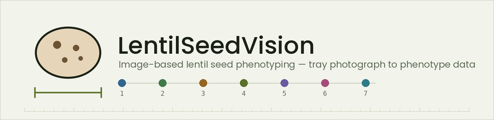

# Lentil Seed Phenotyping — Streamlit App



From a tray photograph to phenotype data you can publish from. The app follows
the seven-panel workflow: quality control, YOLO detection, per-seed
segmentation, image-derived phenotypes, physical properties, reliability
checks, and validation against calipers. The trained model ships with the app,
so there is nothing to upload but the photographs.

```
1 Photograph  →  2 Detection  →  3 Outlines  →  4 Phenotypes  →  5 Physical
                                                                     ↓
                        Outputs  ←  7 Validation  ←  6 Reliability
```

## What is here

| Path | Purpose |
|---|---|
| `app.py` | The Streamlit shell: settings, the run, and the eight result panels. No measurement logic. |
| `seedvision/` | The pipeline as a library. One module per workflow panel. Imports no Streamlit, so it runs in a notebook or a cron job. |
| `ui/` | Theme, motion, shared components, and one render function per panel. |
| `assets/` | The animated logo, title banner and loader as live SVG, plus the PNGs GitHub needs. |
| `generate_branding.py` | Rebuilds the PNGs from the same geometry as the SVGs, with Pillow — no SVG renderer required. |
| `cli.py` | Batch phenotyping from the command line, same pipeline, no browser. |
| `model_loader.py` | Finds the model: bundled `best.pt`, then `LENTIL_WEIGHTS_PATH`, then a cached `weights_url` download. |
| `tests/test_pipeline.py` | Smoke test on a synthetic tray with a stub detector — no model, no photographs needed. |
| `best.pt` | Trained YOLO weights, committed so a fresh clone runs straight away. |

### The library, panel by panel

| Module | Panel | What it does |
|---|---|---|
| `stage1_acquisition.py` | 1 | Focus, clipping, illumination uniformity, colour cast, resolution; QC flags with a plain-language reason; scale calibration from a known object or by reading tick spacing off a ruler crop. |
| `stage2_detection.py` | 2 | YOLO wrapper, optional tiled inference for small seeds, IoU **and containment** duplicate merging, edge-truncation flags. |
| `stage3_segmentation.py` | 3 | ROI extraction, four candidate thresholds tried in order, hole filling, contour smoothing, plausibility check. Records which method won for each seed. |
| `stage4_phenotypes.py` | 4 | Morphology (length, width, area, perimeter, Feret, ellipse fit, roundness, solidity, convexity, extent, eccentricity), colour (RGB, CIE-Lab, chroma, hue angle, HSV, texture), coat pattern (spot count, coverage, largest spot, ΔE contrast, pattern class). |
| `stage5_physical.py` | 5 | Millimetres, GMD, AMD, sphericity, surface area, volume, mass, thousand-seed weight; density fitted from a weighed sub-sample. |
| `stage6_reliability.py` | 6 | Detection checks, outline consistency, repeatability under flip/rotate/resize, position drift across the frame, seed-to-seed matching across two shots. |
| `stage7_validation.py` | 7 | Caliper agreement: R², Lin's concordance, RMSE, MAE, bias, Bland–Altman limits, and a one-sentence verdict. |
| `shape.py` | outputs | Elliptic Fourier descriptors, shape atlas, PCA (via SVD), and the outline at ±2 SD along each component. |
| `lotstats.py` | outputs | Lot summary with percentiles and CV, composition, per-photograph summary, GWAS-ready wide table. |
| `export.py` | outputs | CSV, Excel, JSON, annotated tray images (single or as a ZIP), and a bundle carrying all of it plus the run settings and a data dictionary. |
| `report.py` | outputs | The whole run as one self-contained HTML page — trays embedded, charts drawn inline, no network needed to open it. |
| `runner.py` | — | Orchestrates 1–6 over a batch and reports progress through a callback. |

## Install

```bash
python3 -m venv venv
source venv/bin/activate          # Windows: venv\Scripts\activate
pip install -r requirements.txt
```

GPU is optional — `ultralytics` falls back to CPU automatically.

## Run

```bash
streamlit run app.py                       # the app
python -m tests.test_pipeline              # smoke test, needs no model
python cli.py photos/ --out results/ --px-per-mm 20.5 --density 1.30
```

In a notebook or a script:

```python
from seedvision import Detector, RunConfig, run_batch
import cv2

cfg = RunConfig()
cfg.scale.px_per_mm = 20.5
cfg.scale.source = "manual"
cfg.physical.density_source = "literature"

images = [("tray1.jpg", cv2.imread("tray1.jpg"))]
result = run_batch(images, Detector("best.pt"), cfg)

result.seeds.to_csv("per_seed.csv", index=False)
print(result.lot_stats)
print(result.tsw)          # thousand-seed weight with its 95% interval

from seedvision import build_html
from seedvision.export import annotated_zip_bytes
Path("report.html").write_bytes(build_html(result))
Path("trays.zip").write_bytes(annotated_zip_bytes(result.annotated))
```

## What comes out

| Download | What it is |
|---|---|
| HTML report | The whole run as one page: quality control, detection, outlines, phenotypes, physical properties, reliability, validation, lot statistics, and the settings used. Annotated trays are embedded and the charts are drawn into the page, so it opens the same offline. Print to PDF from the browser. |
| Annotated photographs | Boxes, traced outlines, class labels and the count badge, at the photograph's own resolution. One tray or all of them, PNG or JPEG. |
| Per-seed CSV | One row per seed, every trait. |
| Excel workbook | A sheet per table, plus the run configuration. |
| JSON | The same data with the assumptions and configuration attached. |
| GWAS-ready wide table | One row per lot or per photograph, one column per trait, with SDs alongside. |
| Everything (ZIP) | All of the above together, with the data dictionary and a README. |

## Photographing a tray

* Seeds spread apart, not touching. Merged seeds are counted in panel 6, but a
  seed that never separated cannot be un-merged afterwards.
* Even light, matte background, no gloss. Panel 1 reports lighting variation and
  panel 6 tells you whether it reached the numbers.
* At least 60 px across each seed. Move the camera closer rather than cropping.
* A ruler in frame if you want millimetres. Without one the run stays in pixels
  rather than reporting sizes it cannot know.
* Two shots of one undisturbed tray unlock the seed-to-seed repeatability check,
  which is the cheapest error bar available on a single measurement.

## What the numbers rest on

Three assumptions travel with every export, in `run_config.json` and in the
JSON payload, because they are the ones that would otherwise go unnoticed:

1. **Thickness is modelled, not measured.** It is width × 0.62, a published
   geometry ratio. GMD, sphericity, volume, mass and TSW all inherit it.
2. **Mass needs a density.** Either the literature figure for a rough estimate,
   or your own, fitted from a counted sub-sample on a balance.
3. **Scale is only as good as the calibration.** A 2% error in px/mm is a 2%
   error in every length and a 6% error in every volume. Panel 7 is what
   catches it.

## Deployment

The model resolves in this order, so no one is ever asked to upload weights:

1. `best.pt` beside `app.py` — the committed default.
2. `LENTIL_WEIGHTS_PATH` — Docker or your own server.
3. `weights_url` in `.streamlit/secrets.toml`, or `LENTIL_WEIGHTS_URL` —
   downloaded once and cached on disk. A GitHub Release asset is the usual
   host:

```bash
gh release create v1.0 best.pt --title "v1.0 weights"
```

```toml
# .streamlit/secrets.toml  (gitignored)
weights_url = "https://github.com/<user>/<repo>/releases/download/v1.0/best.pt"
```

`packages.txt` installs `libgl1`, which fixes the `libGL.so.1` error on
Streamlit Cloud.

## Branding and motion

The mark is the app's own job in miniature: a seed appears, its outline is
traced, its coat markings are read, and a caliper measures it. It is a live SVG
(`assets/logo.svg`) drawn in `currentColor`, so the theme recolours it and the
strokes animate themselves rather than being a picture of an animation.

| Asset | What it is |
|---|---|
| `assets/logo.svg` | The animated mark, used in the app's hero. |
| `assets/banner_title.svg` | Title banner: the seed traces, the caliper measures, then the seven panels light along the rule in workflow order. |
| `assets/loader_seeds.svg` | Shown while the model loads and while a batch runs — seeds drop into a tray and a scan line finds them. |
| `assets/*.png` | Flat versions for GitHub and the favicon, written by `generate_branding.py`. |

`ui/motion.py` holds everything that moves in the app. Motion earns its place
three ways and no others: it shows the app doing its job (the hero, the
loader), it shows progress (the stage spine advancing, the scanning progress
bar), or it shows what changed (headline numbers counting up, a tray wiping in
behind a scan line, the shape atlas drawing itself outline by outline). Only
two things loop: the mark re-measures itself every seven seconds, and the model
status dot breathes. Everything is disabled under `prefers-reduced-motion`.

The counters use CSS `@property`, so a browser without it shows the final
number immediately — the right fallback.

The palette in `ui/theme.py`, `.streamlit/config.toml` and the SVGs is taken
from the workflow figure, one hue per panel, so the app and the figure read as
the same document. Keep them in sync by hand.

Re-run `python generate_branding.py` after editing a colour or the mark. The
old `generating branding.py` (with the space in its name) can be deleted.
